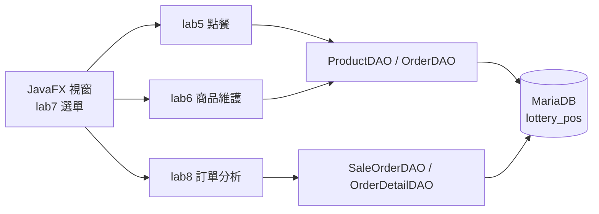

<p align="center">
  <a href="#readme"></a>
  <a href="docs/README.en.md"></a>
</p>

<p align="center">
  
</p>

<h1 align="center">ScratchPOS</h1>

<p align="center">
  <strong>虛構刮刮樂的 JavaFX 銷售示範</strong><br>
  點票、結帳、改庫存，再看當天賣了什麼。<br>
  2023 課程作業，不是官方彩券系統。
</p>

<p align="center">
  
  
  
  
  
  
</p>

<p align="center">
  <a href="#功能">功能</a> ·
  <a href="#示範">示範</a> ·
  <a href="#架構">架構</a> ·
  <a href="#安裝">安裝</a> ·
  <a href="#專案結構">結構</a> ·
  <a href="#貢獻">貢獻</a> ·
  <a href="docs/README.md">文件索引</a> ·
  <a href="CHANGELOG.md">變更紀錄</a>
</p>

---

課堂要做的是一套連資料庫的 POS：分類菜單、購物車、商品維護。這份作業把飲料店模板改成**虛構刮刮樂**——五個價位、結帳寫入 MariaDB，2026 年補上原本空著的訂單分析，並把官方票面移出公開樹。

> **現況。** 這是 2023 的繳交成品，2026 年才收成可公開的展示倉。商品名全部是「○○示範券」。官方圖、學號報告、舊 SQL 傾印只留在本機 `original-data/`，已被 git 忽略。本倉**不是**任何彩券發行機構的系統。

## 功能

<table>
<tr>
<td width="33%" valign="top">

### 客戶交易

`lab5` 依 2000／1000／500／200／100 切菜單。點圖進購物車，可改數量、刪一筆或清空，兩段式結帳後寫入 `sale_order` 與 `order_detail`。

</td>
<td width="33%" valign="top">

### 商品維護

`lab6` 從資料庫讀商品，可依分類篩選，新增、修改、刪除。DAO 走 `PreparedStatement`，圖片檔名對應 `src/imgs/`。

</td>
<td width="33%" valign="top">

### 訂單分析

`lab8` 不再是「尚未開業」。重整後會算出筆數、營業額、銷售張數，並列出訂單與商品排行。結帳後按「重新整理」。

</td>
</tr>
</table>

| 還有這些 | 為什麼這樣做 |
| --- | --- |
| **選單把 lab 收成一套** | `lab7` 的 MenuBar + TabPane 把點餐、維護、分析與關於頁接在同一個視窗。 |
| **票面是原創示範圖** | `tools/make_demo_cards.py` 畫幾何卡面。2023 用過的官方圖在本機原料庫，不上傳。 |
| **帳密不寫進簡介畫面** | 連線讀 `config/db.properties` 或 `LOTTERY_POS_DB_*`。範本不含真實環境。 |
| **分析可以是空的** | 沒訂單就顯示零與提示，不再假裝系統還沒開業。 |

### 一條完整路徑

```text
MariaDB 執行 sql/lottery_pos.sql
        ↓
複製 config/db.properties.example → config/db.properties
        ↓
NetBeans 開啟專案，主類 lab7 LotteryPosTabPaneMenu
        ↓
客戶交易輸入 → 選價位 → 點票 → 結帳
        ↓
每日訂單分析 → 重新整理
        ↓
看筆數、營業額、張數、排行
```

種子資料有三筆示範訂單（2023-05-04／05），分析頁開起來就有數字。表格與連線細節見 [`docs/database.md`](docs/database.md)、[`docs/installation.md`](docs/installation.md)。

## 架構



沒有伺服器、沒有登入、沒有庫存扣帳。一個桌面行程對本機 MariaDB。

| 層 | 位置 | 責任 |
| --- | --- | --- |
| 殼 | `src/lab7_pos_integration_menubar/` | 選單、分頁、視窗圖示 |
| 點餐 | `src/lab5_pos_order_entry_app_db/` | 菜單磁磚、購物車、結帳 |
| 維護 | `src/lab6_pos_product_maintenance_app/` | 商品 CRUD |
| 分析 | `src/lab8_order_analysis/` | 彙總與排行 |
| 資料 | `src/models/` | JDBC DAO、`DBConnection` |
| 種子 | `sql/lottery_pos.sql` | 三表＋虛構商品 |
| 票面 | `src/imgs/`、`tools/make_demo_cards.py` | 原創示範圖 |

<details>
<summary><strong>技術細節（可折疊）</strong></summary>

<br>

- 2023 環境：NetBeans 8.2、Java 8（內建 JavaFX）、MariaDB 11、Connector/J 2.2.3。
- 資料庫從學號名稱改成 `lottery_pos`。連線順序：環境變數 → `db.properties` / `config/db.properties` → `localhost` + 課程預設 `mis` / `mis123`。
- `OrderDetail` 同時留 snake_case 與 camelCase getter，因為 TableView 與後來的 DAO 各用一套。`setQuantity` 會重算小計。
- 訂單編號是 `ord-` 加現有最大值加一，不是資料庫序列。
- 種子三筆：金庫 2000、紅包＋三張行運共 5000、兩張起手＋四張聚寶共 800。
- `bootstrap3.css` 是課堂用的樣式表，不是完整 Bootstrap 發行版。
- 展示倉相對 2023 繳交檔：換掉官方圖與商品名、補分析頁、帳密外置、學號與本機路徑移出公開樹。點餐與維護流程沒有重寫。

</details>

## 安裝

需要 **JDK 8**（含 JavaFX）、**NetBeans 8.2** 或能跑 JavaFX 的同等環境，以及本機 **MariaDB**（埠 3306）。

### 1. 建立資料庫

```sql
SOURCE sql/lottery_pos.sql;
```

HeidiSQL / DBeaver / 命令列都可以。預設庫名 `lottery_pos`。

### 2. 設定連線

```powershell
Copy-Item config\db.properties.example config\db.properties
```

必要時改帳號，或改設：

```powershell
$env:LOTTERY_POS_DB_URL = "jdbc:mariadb://localhost:3306/lottery_pos"
$env:LOTTERY_POS_DB_USER = "mis"
$env:LOTTERY_POS_DB_PASSWORD = "mis123"
```

`config/db.properties` 已被 git 忽略。

### 3. 執行

NetBeans：開啟這個資料夾，主類已是 `lab7_pos_integration_menubar.LotteryPosTabPaneMenu`，`lib/mariadb-java-client-2.2.3.jar` 已在 classpath。

驅動是 LGPL，本倉帶一份是為了課堂能直接開。版本與下載見 [`docs/installation.md`](docs/installation.md)。

## 專案結構

```text
src/lab5_…/            客戶交易輸入
src/lab6_…/            商品維護
src/lab7_…/            選單殼（主程式）
src/lab8_…/            訂單分析
src/lab9_about/        作者、介紹、圖片來源
src/models/            JDBC 與實體
src/imgs/              原創示範票面
sql/lottery_pos.sql    種子資料庫
lib/                   MariaDB Connector/J
config/                連線範本
tools/                 票面產生器
docs/                  說明與 Hero；英文在 README.en.md
LICENSE                MIT（只管本倉程式與文件）
CONTRIBUTING.md        貢獻約定
CHANGELOG.md           Keep a Changelog 2.0.0
original-data/         2023 原料庫，已被 .gitignore
```

「為什麼官方圖不進 git」見 [`docs/README.md`](docs/README.md)。

## 貢獻

這是封存的課程作業。歡迎修正文件、補環境註記、修展示腳本的明顯缺陷；請不要把 `original-data/`、官方票面或真實帳密推進公開分支。細節在 [`CONTRIBUTING.md`](CONTRIBUTING.md)。

## 授權

程式與文件：[MIT](LICENSE) © 2023–2026 張任沂。2023 課程原作；2026 年收成展示倉。

票面與圖示是本倉產生的示範圖，**不是**官方彩券。MariaDB Connector/J 依其 LGPL 使用。本機 `original-data/` 裡的第三方圖與學號報告不是本授權範圍，也不在本倉裡。

---

<p align="center">
  <sub>課程作業 · 2023 · 2026 年收成展示倉</sub>
</p>
