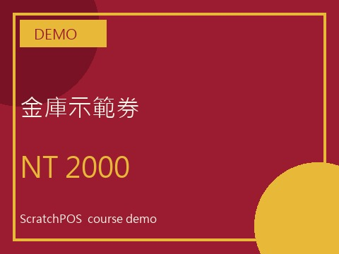
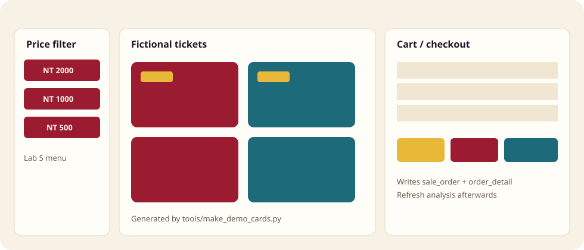
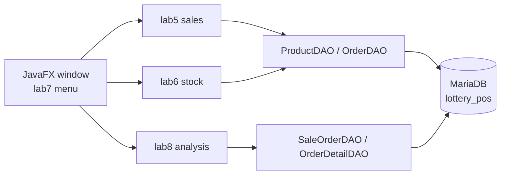

<p align="center">
  <a href="../README.md"></a>
  <a href="#readme"></a>
</p>

<p align="center">
  
</p>

<h1 align="center">ScratchPOS</h1>

<p align="center">
  <strong>A JavaFX till for fictional scratch-cards</strong><br>
  Pick a ticket, check out, edit stock, then see what sold.<br>
  2023 coursework — not an official lottery system.
</p>

<p align="center">
  
  
  
  
  
  
</p>

<p align="center">
  <a href="#features">Features</a> ·
  <a href="#demo">Demo</a> ·
  <a href="#architecture">Architecture</a> ·
  <a href="#installation">Installation</a> ·
  <a href="#project-structure">Structure</a> ·
  <a href="#contributing">Contributing</a> ·
  <a href="./README.md">Docs index</a> ·
  <a href="../CHANGELOG.md">Changelog</a>
</p>

---

The brief was a database-backed POS: category menus, a cart, and product maintenance. This hand-in swapped the drinks-shop template for **fictional scratch-cards** — five price bands, checkout into MariaDB. In 2026 the empty analysis tab was filled in, and official ticket art was taken out of the public tree.

English in this repository is **English**.

> **Status.** This is the 2023 submitted build, packaged for GitHub in 2026. Every product is a “demo ticket”. Official artwork, student-id reports and the old SQL dump stay in local `original-data/` and are gitignored. This repository is **not** an official lottery operator project.

## Features

<table>
<tr>
<td width="33%" valign="top">

### Sales

`lab5` splits the menu into 2000 / 1000 / 500 / 200 / 100. A click adds a line; quantity can be edited; one row or the whole cart can be cleared. A two-step checkout writes `sale_order` and `order_detail`.

</td>
<td width="33%" valign="top">

### Stock maintenance

`lab6` reads products from the database, filters by category, and inserts, updates or deletes. DAOs use `PreparedStatement`. Photo file names map to `src/imgs/`.

</td>
<td width="33%" valign="top">

### Order analysis

`lab8` is no longer “not yet open”. Refresh shows order count, revenue, tickets sold, the order list and a product ranking. Check out, then refresh.

</td>
</tr>
</table>

| Also | Why |
| --- | --- |
| **One window for the labs** | `lab7` MenuBar + TabPane hosts sales, maintenance, analysis and about pages. |
| **Faces are original demos** | `tools/make_demo_cards.py` paints geometric cards. The 2023 official images stay in the local dump. |
| **Credentials left the about page** | Connection reads `config/db.properties` or `LOTTERY_POS_DB_*`. The example file is empty of secrets. |
| **Empty analysis is allowed** | No orders → zeros and a hint, not a pretence that the shop is closed. |

## Demo

There is no classroom film in the public tree. Below is one public demo card and a three-pane schematic.

<p align="center">
  
</p>
<p align="center"><sub>Vault demo ticket. Yellow DEMO chip, geometric blocks — not an official ticket. Other prices come from the same script.</sub></p>

<p align="center">
  
</p>
<p align="center"><sub>Left: price filter. Centre: fictional tiles. Right: cart and checkout. A schematic, not a screenshot.</sub></p>

### One path through

```text
Run sql/lottery_pos.sql in MariaDB
        ↓
Copy config/db.properties.example → config/db.properties
        ↓
Open the folder in NetBeans; main class is lab7 LotteryPosTabPaneMenu
        ↓
Sales → pick a price band → tap a ticket → check out
        ↓
Daily analysis → Refresh
        ↓
Read counts, revenue, tickets, ranking
```

The seed has three demo orders (4–5 May 2023), so analysis has numbers on first launch. Schema and connection notes: [`database.md`](database.md), [`installation.md`](installation.md).

## Architecture



No server, no login, no stock decrement. One desktop process talks to local MariaDB.

| Layer | Where | Job |
| --- | --- | --- |
| Shell | `src/lab7_pos_integration_menubar/` | Menu, tabs, window icon |
| Sales | `src/lab5_pos_order_entry_app_db/` | Tiles, cart, checkout |
| Stock | `src/lab6_pos_product_maintenance_app/` | Product CRUD |
| Analysis | `src/lab8_order_analysis/` | Totals and ranking |
| Data | `src/models/` | JDBC DAOs, `DBConnection` |
| Seed | `sql/lottery_pos.sql` | Three tables + fictional stock |
| Faces | `src/imgs/`, `tools/make_demo_cards.py` | Original demo art |

<details>
<summary><strong>Technical notes (collapsible)</strong></summary>

<br>

- 2023 environment: NetBeans 8.2, Java 8 (bundled JavaFX), MariaDB 11, Connector/J 2.2.3.
- The schema is now `lottery_pos`. Lookup order: environment variables → `db.properties` / `config/db.properties` → `localhost` with the course defaults `mis` / `mis123`.
- `OrderDetail` keeps both snake_case and camelCase getters because TableView and the later DAOs disagreed. `setQuantity` recalculates the line total.
- Order numbers are `ord-` plus max-plus-one, not a database sequence.
- Seed: vault 2000; packet + three trail tickets = 5000; two start + four bowl tickets = 800.
- `bootstrap3.css` is the classroom sheet, not a full Bootstrap release.
- Drift from the 2023 hand-in: official art and product names replaced, analysis filled in, credentials externalised, student-id and machine paths removed from the public tree. Sales and maintenance flows were not rewritten.

</details>

## Installation

You need **JDK 8** (with JavaFX), **NetBeans 8.2** or an equivalent JavaFX runner, and local **MariaDB** on port 3306.

### 1. Create the database

```sql
SOURCE sql/lottery_pos.sql;
```

HeidiSQL, DBeaver or the CLI are fine. Default schema: `lottery_pos`.

### 2. Configure the connection

```powershell
Copy-Item config\db.properties.example config\db.properties
```

Change the account if needed, or set:

```powershell
$env:LOTTERY_POS_DB_URL = "jdbc:mariadb://localhost:3306/lottery_pos"
$env:LOTTERY_POS_DB_USER = "mis"
$env:LOTTERY_POS_DB_PASSWORD = "mis123"
```

`config/db.properties` is gitignored.

### 3. Run

In NetBeans, open this folder. The main class is already `lab7_pos_integration_menubar.LotteryPosTabPaneMenu`. `lib/mariadb-java-client-2.2.3.jar` is on the classpath.

The driver is LGPL; a copy is bundled so the classroom project opens. Versions: [`installation.md`](installation.md).

## Project structure

```text
src/lab5_…/            Sales
src/lab6_…/            Stock maintenance
src/lab7_…/            Menu shell (entry point)
src/lab8_…/            Order analysis
src/lab9_about/        Author, intro, image sources
src/models/            JDBC and entities
src/imgs/              Original demo faces
sql/lottery_pos.sql    Seed database
lib/                   MariaDB Connector/J
config/                Connection example
tools/                 Card generator
docs/                  Notes and hero; this file is the English tour
LICENSE                MIT (this repository’s code and docs)
CONTRIBUTING.md        Contribution rules
CHANGELOG.md           Keep a Changelog 2.0.0
original-data/         2023 dump, gitignored
```

Why official art stays out: [`README.md`](README.md).

## Contributing

This is archived coursework. Documentation fixes, environment notes and obvious defect repairs are welcome. Do not push `original-data/`, official ticket art or live credentials. Details: [`../CONTRIBUTING.md`](../CONTRIBUTING.md).

## Licence

Code and documentation: [MIT](../LICENSE) © 2023–2026 張任沂. Written for the 2023 course; packaged as a showcase in 2026.

Ticket faces and the window icon are original demo graphics. They are **not** official lottery tickets. MariaDB Connector/J remains LGPL. Third-party images and student-id reports in local `original-data/` are outside this licence and are not in the tree.

---

<p align="center">
  <sub>Coursework · 2023 · packaged 2026</sub>
</p>
